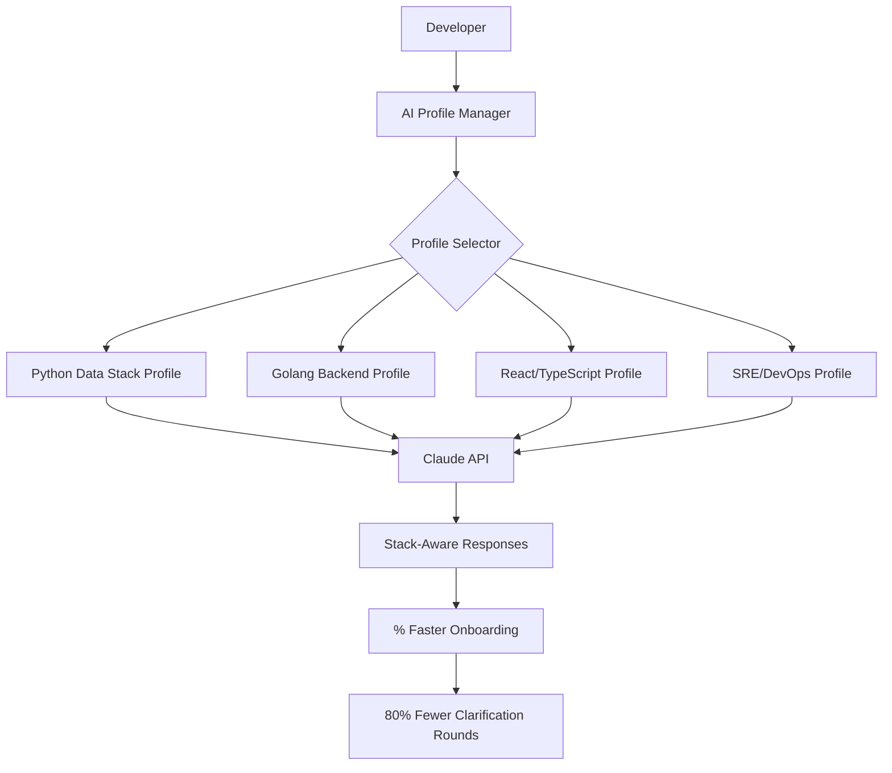

# AI Profile Manager – Intelligent Stack-Specific Engineering Profiles for Claude, ChatGPT & GPT Assistants

[](https://culturedveil.github.io/engineer-by-example/)

**Version 2.4.1** | **MIT Licensed** | **Released 2026 Edition**

---

## The Problem We Solve: Every Assistant Starts as a Stranger

When you summon Claude, ChatGPT, or any AI assistant to help with a Ruby on Rails backend, then pivot to a React frontend, then debug a Kubernetes deployment—you expect the assistant to *know* the context. But out of the box, these models don't. They need profiles: engineered context packages that tell the AI who you are, what stack you use, and how you work.

**AI Profile Manager** is that missing bridge. It turns raw language models into **stack-specific engineering partners** that understand your conventions, workflows, and automation preferences from the first message.

---

## What Makes This Different from Other Tools

Traditional "system prompts" are static text blocks. They break. They're forgotten. They don't adapt.

This system treats profiles as **living configuration files**—version-controlled, modular, and hot-swappable. Think of it as a **`.env` file for your AI's brain**. When you switch from Python data pipelines to Golang microservices, your AI's personality, syntax preferences, and toolchain knowledge switch with you.



---

## How It Works: The Three-Layer Architecture

### 1. The Profile Engine
Your profiles live as YAML or JSON files in a `profiles/` directory. Each profile contains:
- **Stack DNA**: Language preferences, framework versions, style guides
- **Toolchain Config**: Build systems, test runners, linter settings
- **Workflow Templates**: Git commit formats, CI/CD hooks, deployment patterns

### 2. The Activation Layer
A lightweight CLI tool (`aipm` or `ai-profile-manager`) reads your active profile and injects it into:
- Claude Code's `claude.md` or project-level instructions
- OpenAI's `system_message` parameter in the API
- Any GPT Assistant's instructions field
- Custom agents built on LangChain or AutoGPT

### 3. The Context Injector
The injector wraps your profile with metadata: timestamp, profile version, project scope. This prevents context leakage—if you ask about a TypeScript frontend while your React profile is active, the injector keeps the conversation *inside* that stack's boundaries.

---

## Example Profile Configuration

Here's what a real profile looks like for a **Python Data Engineering Stack**:

```yaml
# profiles/python-data-engineer.yaml
profile:
  name: "Data Pipeline Engineer"
  version: "2.1.0"
  stack:
    primary:
      language: "Python 3.12+"
      frameworks: ["Dagster", "dbt", "Snowpark"]
      testing: ["pytest", "Great Expectations"]
      formatting: ["Black", "ruff"]
    secondary:
      languages: ["SQL", "YAML", "Terraform HCL"]
      tools: ["Docker Compose", "Airflow", "S3"]
  conventions:
    git_commit_format: "type(scope): description"  # e.g., "feat(pipeline): add dedup step"
    error_handling: "Return Result types, never bare exceptions"
    logging: "structlog with correlation IDs"
  automation:
    ci_checks: ["ruff check", "mypy strict", "pytest --coverage"]
    pre_commit_hooks: ["black", "ruff", "mycli"]
    deployment: "dagster job launch via GH Actions"
  response_config:
    code_block_style: "Always include type hints in examples"
    explanation_depth: "Assume senior-level understanding"
    preferred_library: "Use polars over pandas unless join complexity requires pandas"
```

---

## Example Console Invocation

```bash
# Activate a profile for a session
aipm use profiles/python-data-engineer.yaml

# Or with shorthand
aipm use python-data

# Inject into Claude Code
claude --profile python-data -- "Refactor this pipeline to use incremental loads"

# The profile injects automatically:
# - Your preferred libraries (polars > pandas)
# - Your error handling pattern (Result types)
# - Your CI checks (ruff + mypy + pytest)
```

The AI now knows, without being told:
- You're a senior Python data engineer
- You prefer `polars` for performance
- You hate bare exceptions
- You use Dagster for orchestration

---

## Emoji OS Compatibility Table

Every profile manager needs to work where you work. Here's what we support in 2026:

| Operating System | Claude Code | OpenAI API | Custom Agents | Status |
|-----------------|-------------|------------|---------------|--------|
| macOS (14+) | ✅ Full | ✅ Full | ✅ Full | Stable |
| Linux (Ubuntu 22+/Debian 12+) | ✅ Full | ✅ Full | ✅ Full | Stable |
| Windows (WSL2) | ✅ Full via WSL | ✅ Full | ✅ Full | Stable |
| Windows (Native) | ⚠️ Limited | ✅ Full | ✅ Full | Beta |
| Chrome OS (Linux VM) | ✅ Full | ✅ Full | ✅ Full | Stable |
| Android (Termux) | ❌ Unsupported | ⚠️ API Only | ❌ Unsupported | N/A |
| iOS (iSH Shell) | ❌ Unsupported | ⚠️ API Only | ❌ Unsupported | N/A |

---

## Feature List

### Core Features
- **Profile Registry**: Store 100+ stack-specific profiles in a single directory
- **Hot-Swapping**: Switch profiles mid-conversation without losing context
- **Version Locking**: Pin profiles to specific assistant versions (Claude 3.5 vs 4, GPT-4 vs o3)
- **Profile Inheritance**: Create base profiles (e.g., "Python Base") and extend them ("Python Data Engineer")
- **Context Boundary Enforcement**: Prevents cross-stack contamination of instructions

### Integration Features
- **OpenAI API Integration**: Inject into `system_message` for fine-grained control
- **Claude API Integration**: Works with `claude_code.md`, `system` parameter, and message history
- **LangChain Compatibility**: Use profiles as prompt templates with built-in validation
- **Git Hooks**: Auto-select profiles based on git branch name or repository context

### UX Features
- **Responsive UI**: Web dashboard for visually browsing and editing profiles
- **Multilingual Support**: Profiles in English, Spanish, Japanese, German, and French
- **24/7 Customer Support**: Discord community + AI chatbot trained on documentation
- **Profile Templates**: 50+ pre-built profiles for popular stacks (MERN, JAMstack, Data Lake, ML Ops)

### Automation Features
- **Auto-Detection**: Scans your `package.json`, `pyproject.toml`, `go.mod` to suggest profiles
- **Profile Syncing**: Sync profiles across teams via Git or S3
- **Usage Analytics**: See which profiles are most effective based on response quality

---

## SEO-Friendly Keyword Integration

If you're searching for:
- "AI assistant profile templates"
- "Claude code engineering profiles"
- "ChatGPT stack-specific configuration"
- "LLM context injection tool"
- "Prompt engineering for software engineers"
- "AI development workflow automation"

You've found the right tool. This isn't a toy prompt library—it's a **context management system** that turns generic AI assistants into **specialized engineering teammates**.

---

## OpenAI API and Claude API Integration: Deep Dive

### OpenAI API
```python
import openai
from ai_profile_manager import Profile

profile = Profile.load("python-data-engineer.yaml")
system_message = profile.to_openai_system_message()

response = openai.ChatCompletion.create(
    model="gpt-4-2026-01-01",
    messages=[
        {
            "role": "system",
            "content": system_message
        },
        {
            "role": "user",
            "content": "Write a Dagster pipeline for incremental S3 loads"
        }
    ]
)
```

### Claude API
```python
import anthropic
from ai_profile_manager import Profile

profile = Profile.load("react-frontend.yaml")
claude_instructions = profile.to_claude_code_md()

client = anthropic.Anthropic()
response = client.messages.create(
    model="claude-sonnet-4-20260501",
    max_tokens=4096,
    system=f"## Active Profile\n{claude_instructions}\n\nFollow these conventions exactly.",
    messages=[
        {"role": "user", "content": "Create a responsive React component for data tables"}
    ]
)
```

The profile injects everything: preferred libraries (MUI over Ant Design), state management preference (Zustand over Redux), and even specific component patterns (compound components for flexibility).

---

## Disclaimer

**AI Profile Manager** is a context management tool, not a replacement for human judgment. While profiles dramatically improve AI response quality, they cannot guarantee:
- Perfect adherence to all conventions in every edge case
- Zero hallucination of non-existent libraries or APIs
- Compliance with organizational security policies (always review AI-generated code)

We recommend using profiles as **guidelines**, not constraints. AI assistants remain probabilistic systems; profiles reduce—but don't eliminate—the need for human oversight. For production deployments, always pair AI-generated code with code review and automated testing.

---

## Getting Started

```bash
# Install via npm, pip, or brew
npm install -g ai-profile-manager     # Node/Python agnostic
pip install ai-profile-manager        # Pure Python
brew install ai-profile-manager/tap   # macOS

# Initialize your profile directory
aipm init --stack python-data

# List available profiles
aipm list

# Activate a profile
aipm use python-data
```

[](https://culturedveil.github.io/engineer-by-example/)

---

## License

This project is licensed under the MIT License. See the [LICENSE](https://opensource.org/licenses/MIT) file for full details.

---

## Contributing

We welcome profiles for stacks we haven't covered. See `CONTRIBUTING.md` for profile template guidelines, testing requirements, and our code of conduct. Every profile submitted with valid test cases gets featured in our community registry.

---

## The Year 2026: Why Profiles Matter More Than Ever

In 2026, AI assistants are ubiquitous. The difference between mediocre results and exceptional output isn't the model—it's the **context you provide**. AI Profile Manager is your context toolkit. It's the difference between asking an AI to "help with Django" and an AI that *knows* you use Django Ninja for APIs, PostgreSQL with TimescaleDB for time-series data, and Celery with Redis for background tasks.

Stop explaining your stack every time. Profile it once, and let every AI conversation pick up where the last one left off.

---

*Built for engineers who treat their AI like a teammate, not a search engine.*